--- 
title: "docker+jenkins实现自动化部署"          
author: "yunlang"              
description : "描述信息"    
date: 2021-09-21            
lastmod: 2021-09-21         

--- 
## Jenkins 介绍
Jenkins是一个开源软件项目，是基于Java开发的一种持续集成工具，用于监控持续重复的工作，旨在提供一个开放易用的软件平台，使软件项目可以进行持续集成
## Docker
Docker 是一个开源的应用容器引擎，让开发者可以打包他们的应用以及依赖包到一个可移植的镜像中，然后发布到任何流行的 Linux或Windows 机器上，也可以实现虚拟化。容器是完全使用沙箱机制，相互之间不会有任何接口。
## 自动化部署
自动化部署（持续集成/CI+持续交付/CD）不仅可以提升开发效率，让程序员更专注产品与业务的开发，还可以节省很多运维成本以及提升运维效率。

Jenkins是自动化部署中最流行的工具，尤其是Docker+Jenkins的完美搭配，每个程序员都应该掌握这两个工具的使用。

# 1   安装Docker
此步暂略
# 2 Docker下安装Jenkins
### 2.1 搜索docker镜像
docker的hub上有一些我们可以直接使用的镜像，使用这些镜像可以减少我们配置的时间  

```
docker search jenkins
```  

<div align="center">
    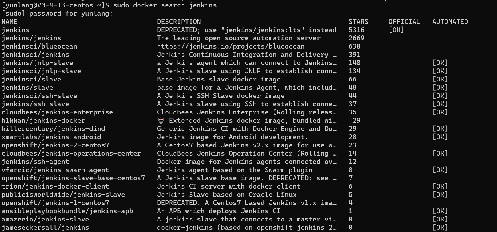
</div>

我们选择使用jenkinsci/blueocean镜像，此镜像已经包含blueocean插件，方便我们使用  

### 2.2 拉取镜像

```
docker pull jenkinsci/bluecoean
```

### 2.3 查看本地镜像

```
docker image ls
```
<div align="center">
    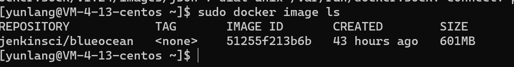
</div>

```IMAGE ID```: 是我们直接操控某一镜像的唯一ID，使用时一般取前三位即可识别
### 2.4 创建Jenkins目录，存放容器数据
```
mkdir /data/jenkins_home
```
### 2.5 启动Jenkin
这里我们采用脚本启动，我的脚本内容如下  
```
sudo docker run \
        -d \  
        -u root \  
        --name jenkins \  
        -p 50000:50000 \  
        -p 8080:8080 \  
        -v /data/jenkins_home:/var/jenkins_home \  
        jenkinsci/blueocean  
```

### 2.6 查看Jenkins启动情况
```
docker ps
```
<div align="center">
    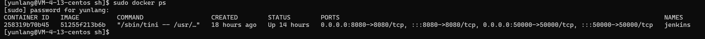
</div>

### 2.7 访问jenkins
jenkins可以通过浏览器进行访问，采用IP:端口号的配置，如我的访问  
http://101.34.42.228:8080/

# 3 管理配置Jenkins
目前，我们已经完成了jenkins的安装，下面可以进行对jenkins的简单配置工作
### 3.1 解锁
初次进入jenkins，会在启动时生成一个解锁密码，需要使用密码登录 

<div align="center">
    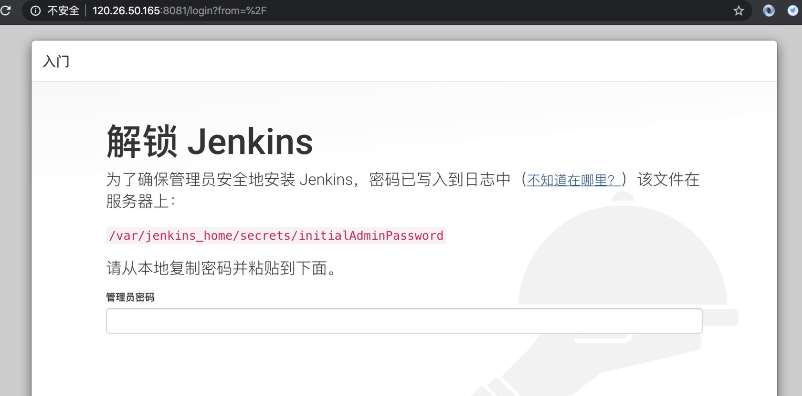
</div> 

进入docker容器查看密码
```
docker exec -it jenkins bash
```
jenkins 还可以使用ID号替代（注意容器ID和镜像ID的区分)  
### 3.2 自定义Jenkins
建议选择安装推荐的插件，减少麻烦
<div align="center">
    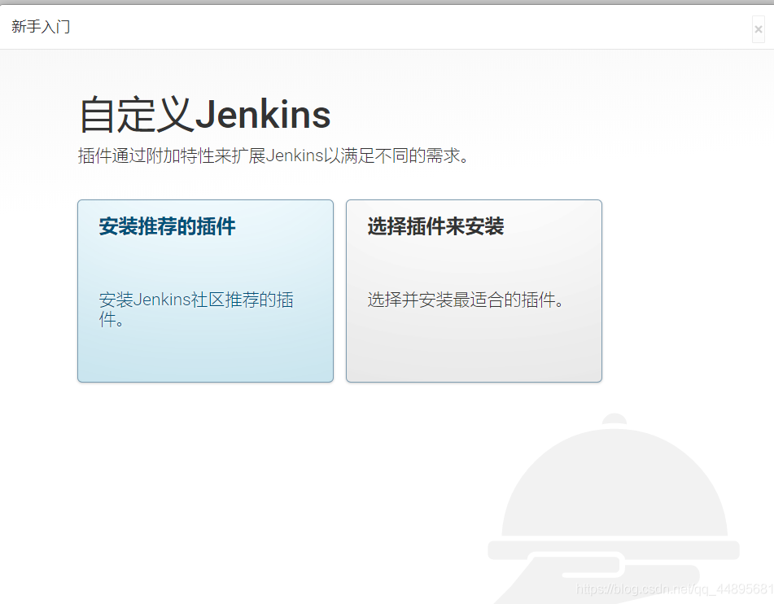
</div> 

### 3.3 创建管理员账户+实例配置
这里实例配置直接默认就好
<div align="center">
    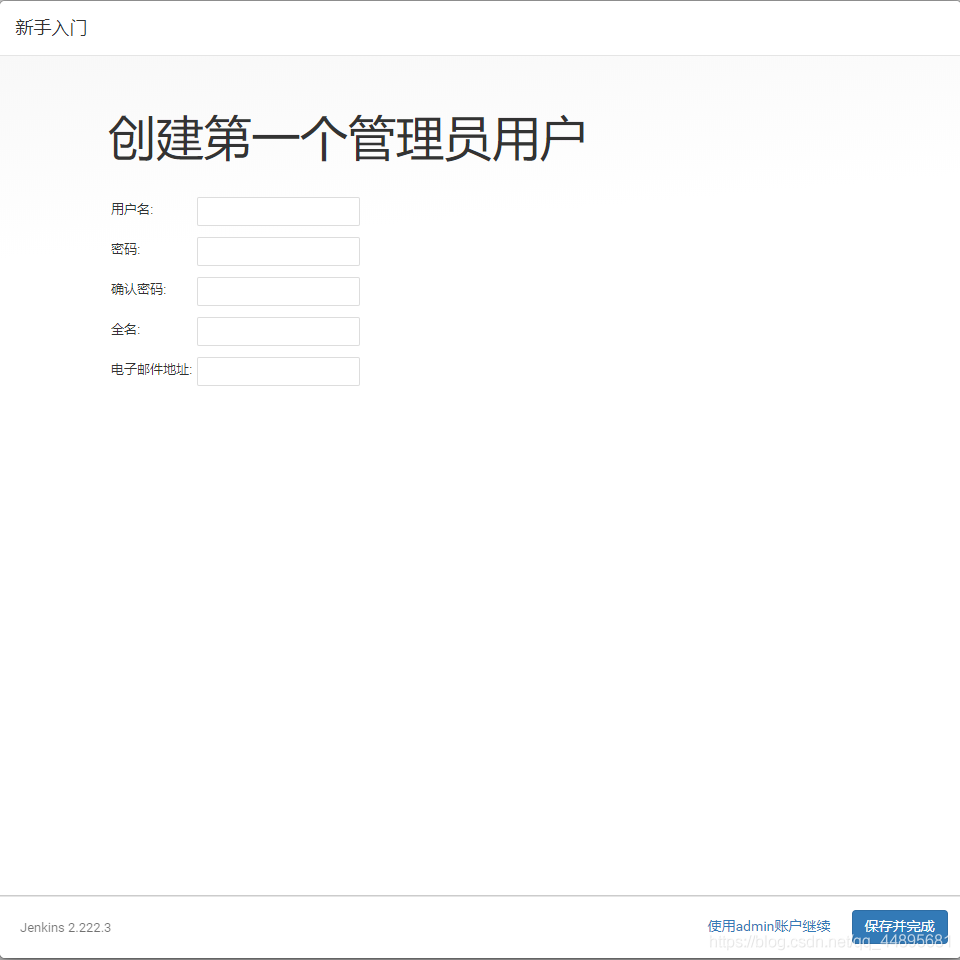
</div> 

# 4 配置Jenkins邮箱
## 4.1 安装邮箱插件
jenkins自带邮件通知，但是不好用，这里介绍一种插件的方法。  
通过系统管理→管理插件→可选插件，选择Email Extension Plugin插件

<div align="center">
    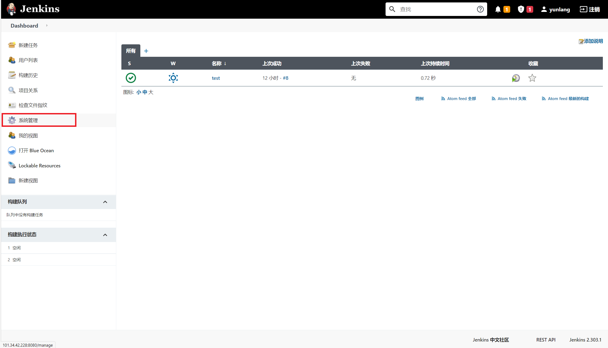
</div> 

<div align="center">
    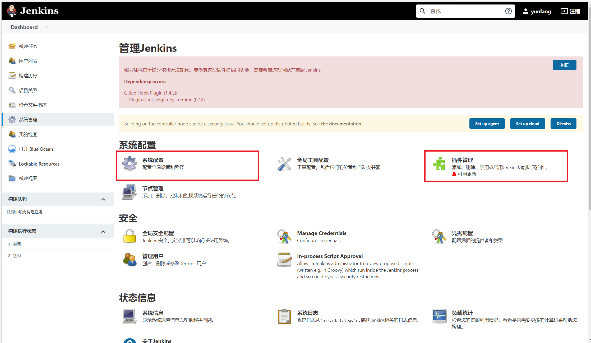
</div> 

<div align="center">
    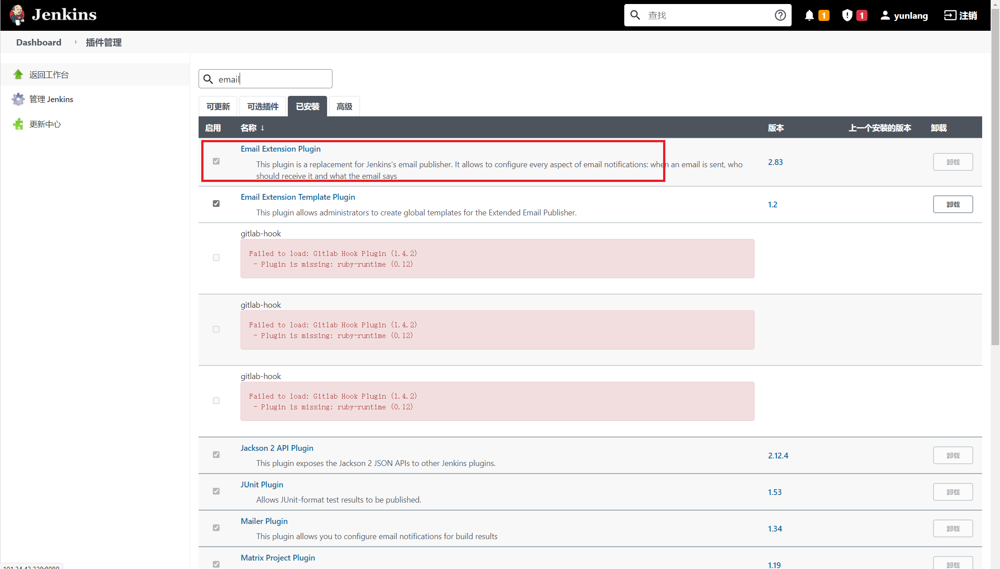
</div> 

## 4.2 进行系统设置
通过系统管理→系统设置，进行邮件配置  

<div align="center">
    
</div>

### 4.2.1 设置jenkins地址和管理员邮箱地址  

<div align="center">
    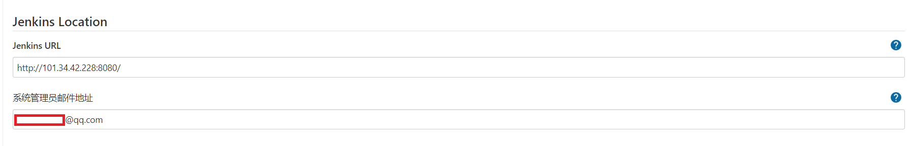
</div> 


### 4.2.2 设置发件人等信息

<div align="center">
    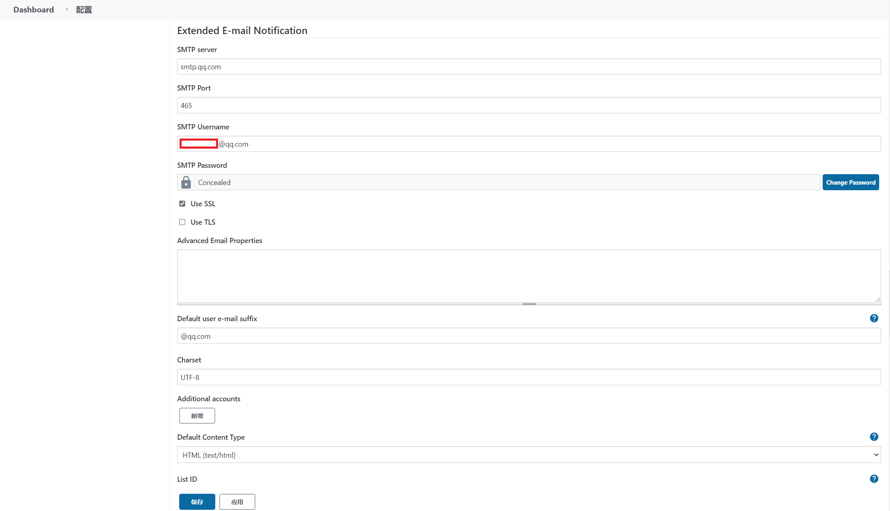
</div> 

<div align="center">
    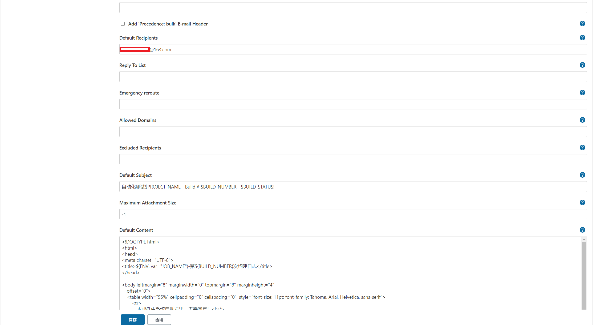
</div> 

<div align="center">
    
</div> 


这里的发件人邮箱需要和系统管理员邮箱保持一致。  
针对SMTP，密码需要在自己的邮箱设置处设置SMPT授权码  
SSL服务是否开启由自己邮箱配置决定，不然可能出现设置后无法使用的情况  
### 4.2.3 测试邮箱是否能成功使用
<div align="center">
    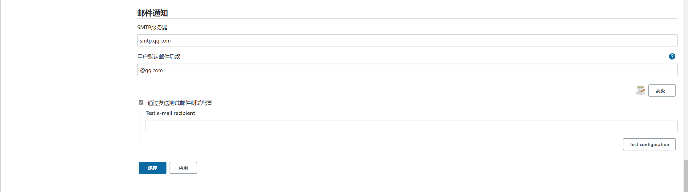
</div> 
